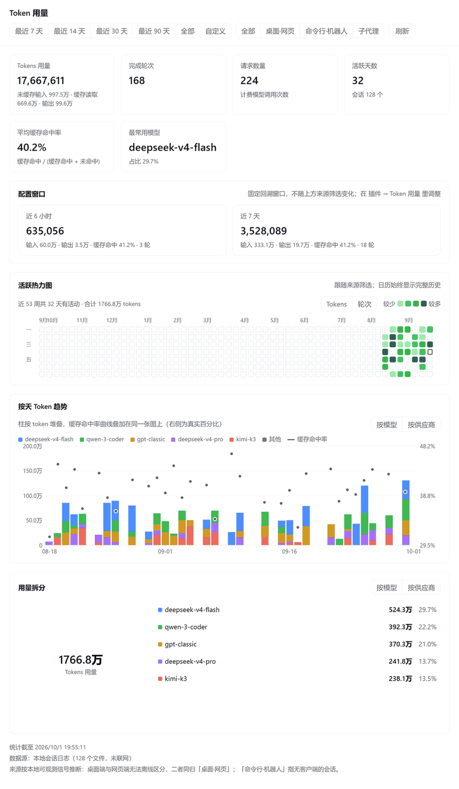
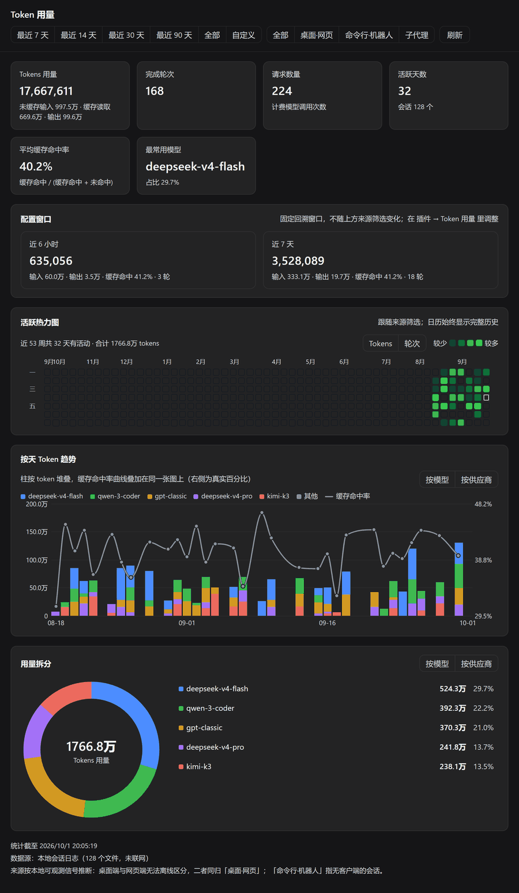
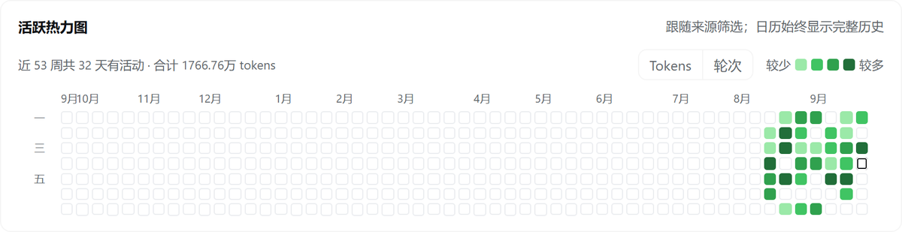
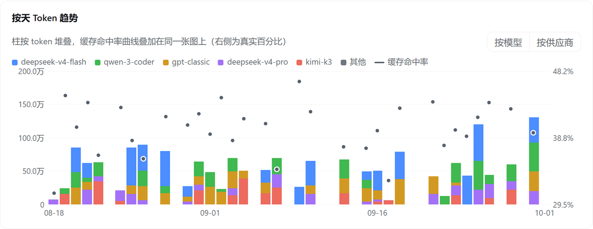

# dsh-desktop-token-usage

English | [中文](https://github.com/jd04063221/dsh-desktop-token-usage/blob/main/README-zh.md)

A **fully offline** token usage statistics plugin for DSH (DeepSeek Harness).

- The **Host half** scans `$DSH_HOME/sessions/**/session.vN.jsonl.zstd` and folds out the real token usage;
- The **Client half** mounts a usage card at the foot of the left sidebar; clicking it opens a dashboard in the central
  panel: time-range and source filters, 6 stat cards, a configured-windows row, an activity heatmap, a per-day token
  trend (a cache hit-rate curve overlaid on the token bars, real percentages labelled on the right, its Y axis padded
  10% beyond the period's min/max), and a model usage donut chart with a list.

Which time spans the card and the dashboard's **Configured windows** row report is decided by the **plugin
configuration** (both windows are off by default): in **Settings → Plugins → `Token 用量`** (Token usage) you can
enable a "last N hours" window (0-23) and a "last N days" window (1-30) independently; turn both off and each surface
falls back to a single cumulative block.
Those windows are wall-clock recency and deliberately ignore the dashboard's source filter, so they sit in a row of
their own rather than among the filter-following stat cards.
The same settings page also picks the **grouping** — by model, by provider, or both (with both, the trend section
and the breakdown section, `用量拆分`, each get a switchable chip) — and the **color palette** — primer, cvd or muted,
each with a light and a dark set that follows DSH's own light/dark switch (`body[data-ds-dark-theme]`), so the
charts never disagree with the shell.

The sidebar foot is one horizontal row shared with every other plugin registered there, and every one of them declares
`width: 100%` — so no two of them can share it. Measured live, with nothing intervening this card is squeezed to
105.2px. The card therefore turns that row into a **column** (`[class*="_footerActions"]:has(.dtu-footCard)` — keyed on
the class suffix plus `:has()`, so nothing depends on DSH's hashed class names and no ancestor is touched), which gives
each plugin in the seat the full-width line it was written for; this card spans the whole 256px. It is `flex-direction`
rather than `flex-wrap` because the shell wraps each slot in a `display: contents` element — a direct-child selector
never matches the seat — and because on a column seat `flex-wrap` means "start another column", which pushes the card
beside its neighbour instead. That needs `:has()`; see the compatibility table below.

No network access, no telemetry, no API calls: every number comes from session logs that are already on your machine.

## Screenshots

Rendered from this plugin's own components with **sample data** — the shots are produced offline by
[`scripts/render-shots.mjs`](scripts/render-shots.mjs) (the real `client.js` and CSS against a fake Host) plus
[`scripts/render-shots.py`](scripts/render-shots.py) (headless Chrome), so no session logs, paths or account
details are involved. Light theme first, dark theme second.



Six stat cards, the configured-windows row, the activity heatmap, the per-day token trend with the cache hit-rate
curve overlaid on the bars, and the model usage breakdown.



The same dashboard on the dark theme — each palette ships a light and a dark set.

| Activity heatmap | Per-day trend |
|---|---|
|  |  |

## Compatibility and tested environment

**Fully verified on DSH Desktop 0.1.7-rc.2, checked for compatibility with 0.2.0-rc.1, and plugin 0.1.3 was tried by hand on 0.2.0-rc.2 with no problems.**

| Item | Tested environment |
|---|---|
| DSH | Desktop `0.1.7-rc.2` (full verification), `0.2.0-rc.1` (compatibility check) and `0.2.0-rc.2` (manual trial of `0.1.3`) |
| Bundled runtime | Electron 44 / Chromium 152 / Node 24.18.1 (turning the seat into a column needs `:has()`, Chrome 105+) |
| Operating system | Windows 11 Pro, build 26200, AMD64 |
| Node (used to run the tests) | v25.2.1, v26.7.0 |

Verification went well beyond "it installs": plugin activation reaching `fiberPhase: active`, the sidebar card and the
central dashboard rendering, the config card that the plugin page carries being readable and writable, the
browser → Host Remote calls working end to end, and every field matching DSH's own projection cache in a cross-check.

For `0.2.0-rc.1` the check was structural rather than a second full run. Every published package this plugin touches
was diffed against `0.1.7-rc.2`: `dsh-plugin-manager` is byte-identical, and in `dsh-client-ui-sidebar`,
`dsh-client-ui-layout` and `dsh-client-ui-cordis` only the version string, one analytics call and title-bar CSS differ.
The `sidebar.footer.action` slot contract and its `{ wide }` owner props are unchanged, and the packages this plugin
imports (`dsh-api-remotes`, `dsh-client-ui-layout`, `dsh-client-ui-sidebar`) keep their names. A manual trial on
`0.2.0-rc.1` reports the dashboard and the Remote calls working; plugin `0.1.3` was likewise tried by hand on
`0.2.0-rc.2` and reports the same.

This plugin declares **no** `@deepseek-ai/dsh*` peer dependency, and that is what DSH actually validates — an absent
peer range applies no version constraint at all. `engines.dsh` is declared as `^0.1.7-rc.2 || ^0.2.0-rc.1` for humans
only: the official documentation states plainly that declaring a range does not reject incompatible hosts.

**Versions other than the table above are untested.** Earlier DSH builds may lack the `plugins.bundle.config` slot and
the `configEditor` service this plugin uses (without them there is no config card, and configuration can only be edited
by hand in the profile patch); builds newer than `0.2.0-rc.2` have not been verified yet.

## What it writes to disk

The plugin reads session logs and writes only inside one directory of its own:
`$DSH_HOME/cache/dsh-desktop-token-usage/`. Nothing is written next to a session log, nothing elsewhere under
`$DSH_HOME` is created, modified or deleted, and no network access is ever made.

| File in that directory | Written by | Purpose | To switch it off |
|---|---|---|---|
| `sessions-index.json` | `lib/session-usage.js` | Per-session fold cache, so a warm call does not re-scan every `session.vN.jsonl.zstd` | Delete it; it is rebuilt on the next call |
| `calls.json` | `index.js` | Diagnostics: the last 20 Remote calls | `DSH_TOKEN_USAGE_DIAG=0` |
| `boot.json` | `index.js` | Diagnostics: when the fiber was last applied | `DSH_TOKEN_USAGE_DIAG=0` |

Both writers are **atomic**: they write a `<name>.<pid>.tmp` sibling and rename it over the target, so a concurrent
reader never sees a partial file and a killed process cannot leave a truncated one behind. The index is capped at 800
entries (oldest dropped, re-scanned on demand), and any `.tmp` a crash left behind is swept on the next write.

## Installation

This repository is a DSH bundle (`package.json` declares `dsh.bundle.patch` and `dsh.client`). Install it through the
official entry point; no manual editing of profile files is needed:

```
plugin_manager  action: install_bundle  target: <absolute path to this directory>
```

Because this package depends on `@deepseek-ai/schemastery` (the schema library the official Config card needs), and
`install_bundle` uses a `link:` install for local directories and does **not** install dependencies for linked
packages, install once inside this repository first:

```
npm install            # installs dev/runtime dependencies only, no network data
```

### After editing the code: the client hot-reloads, the Host needs a restart

| Which half you changed | How it takes effect |
|---|---|
| `client.js` (UI) | The browser-side module snapshot is pushed to the page by HMR once its mtime/size changes; if it does not take effect, hard-refresh the page once (Ctrl/Cmd+Shift+R) |
| `index.js` / `lib/*` (Host) | **DSH must be restarted**: re-enabling the entry only remounts the fiber, it does not re-import the cached JS module generation. Likewise, adding or changing `Config` fields also requires a restart before they appear in Settings |

To tell which version is currently running: check whether `$DSH_HOME/cache/dsh-desktop-token-usage/boot.json` exists and
whether `windows` matches expectations.

Uninstall: `plugin_manager action: remove_bundle target: dsh-desktop-token-usage`.

> The package name and the plugin **row id** are two different things: the row id is `dsh-desktop-token-usage` (the anchor for
> configuration overrides in the profile), and the package name is `dsh-desktop-token-usage`. Use the package name
> to uninstall/install, and the row id to change configuration.

## Usage

1. Look at the card at the **bottom of the left sidebar**, above Settings: it shows each window's input/output volume
   and cache hit rate according to your configuration;
2. Click it → the dashboard opens in the central panel;
3. At the top of the dashboard you can filter by **time range** (last 7/14/30/90 days, all, custom) and by **source**;
   a refresh button sits in the bottom-right corner.

Both filtering and aggregation happen in the Host: every change issues a fresh aggregation request to the Host (the
Host keeps an index cache keyed by file mtime+size, so warm calls are in the hundreds of milliseconds). The card
quietly refreshes once every 5 minutes — the hour window slides with the clock anyway, so it should update even when
there is no new usage.

### How to read the activity heatmap

- It is a **calendar** (Monday-aligned, the last 53 weeks) with **month** and **weekday** axes; cells are a fixed
  11px and are never stretched to the panel width;
- The color scale uses **quartiles over non-zero days**, not "day ÷ maximum" — with the latter, a single
  exceptionally large day presses everything else into the same shade of gray;
- The header toggles between **Tokens / turns**; the default is whichever dimension has **more days with data** (on a
  machine with a lot of imported history tokens are sparse, so drawing tokens by default would give an almost empty
  grid);
- It **follows the source filter but is not affected by the time range**: a calendar filtered down to 7 days would
  mean "7 lit cells in a year grid", which is exactly what a heatmap should not look like.

## Configuration

Edit these in the **Plugins → `Token 用量`** page (Token usage) — the `Plugins` entry in the sidebar → `Token 用量`:
in the middle of the page you get two input boxes labelled `侧边栏卡片显示的时间跨度` (the time span shown on the
sidebar card) and a save button.

DSH does **not** generate an editor automatically from the `Config` schema — a plugin that brings its own configuration
has to render the form into the `plugins.bundle.config` slot (addressed by package name). That is what this plugin
does: on save it calls the official `configEditor`, and the values end up in the profile's `cordis.patch.yml`, so you
can also write them there directly:

```yaml
- id: dsh-desktop-token-usage
  disabled: false
  config:
    hours: 6
    days: 7
```

| Key | Default | Description |
|---|---|---|
| `hours` | `0` | How many hours the Configured windows section reports (0-23). `0` = turn this window off |
| `days` | `0` | How many days the Configured windows section reports (1-30). `0` = turn this window off |

With both off (the default) the card shows cumulative values, just as before these two parameters existed. Windows
round to the hour in **local time**: "last 6 hours" means starting from the top of the hour 6 hours ago.

Changes take effect **immediately** after saving: Cordis's `fiber.update()` restarts this plugin's fiber and `apply`
runs again with the new configuration (so you never need to restart DSH to change a value); after saving, the form
re-reads the configuration and refreshes the card automatically.


## Data semantics

This section matters — what the numbers mean is determined entirely by DSH's log semantics.

| Metric | Definition |
|---|---|
| Tokens usage | `uncached input + output + cache read + cache write` |
| **Input volume** (card) | `uncached input + cache read` — that is, every prompt token the provider actually received |
| **Output volume** (card) | `usage.outputTokens` (`reasoningTokens` is a **subset** of it and is never counted twice) |
| Uncached input | `usage.inputTokens` — **in the provider's native fields this is already the part that missed the cache**; DSH's own projection renames it to `uncachedInputTokens` |
| Cache read / write | `usage.cacheReadTokens` / `usage.cacheWriteTokens` |
| Average cache hit rate | `cache read ÷ (cache read + uncached input + cache write)` — the miss side includes cache writes |
| Request count | Number of model calls after settlement (see "fold" below) |
| Completed turns | Number of `turn/end` events |
| Group by model | The **last segment** of the model id: one model arrives as `deepseek/deepseek-v4.1-flash` from `commandcode` and as `deepseek-v4.1-flash` from `opencode-go`, and both fold into one row; grouping by provider still keeps the two apart |

**Fold semantics (an easy place to get the math wrong)**: within the same `(turn, step)`, a later usage entry
**replaces** the earlier one — the streaming numbers are overwritten by the final settlement; only after
`llm/retry-started` closes the slot does another retry call **accumulate**. So "total = sum of all usage" is wrong; you
must fold. This plugin's folding logic corresponds line for line with the `tokenUsage` projection in
`dsh-token-meter`, and is covered by cross-check tests.

### Why the source filter has only three options

DSH 0.1.7-rc.2's session logs have **no** "client source" field: `SessionHeader` carries only
`version/id/createdAt/cwd/parentSession/isSeeded/origin/delegationDepth/agentPreset`, and the only value `origin`
ever takes is `'subagent'`. Desktop and web cannot be told apart from local data. The dashboard therefore offers only
the three options that are **derivable from local signals**:

| Label | How it is determined |
|---|---|
| Desktop · web | A real user turn exists (`user/message` with `source.kind ∈ {user, user-approval}`) and it carries `source.rpcId` |
| CLI · bot | There is a real user turn but **no** `rpcId` (headless / SDK / ACP / bots and the like, with no client driving) |
| Subagent | `header.origin === 'subagent'` or `delegationDepth > 0` |

Sessions with no user turn at all (for example, ones that only ran slash commands) count toward `全部` (all) and are
not listed separately.

## Known limitations

- **The first aggregation is slow**: with roughly 150 session files and 90,000+ records, a cold start takes about
  3–4 seconds; after that it goes incremental by file fingerprint, with warm calls in the hundreds of milliseconds.
  The cache is written to `$DSH_HOME/cache/dsh-desktop-token-usage/sessions-index.json`; deleting it only makes the next run
  slower.
- **Imported historical sessions may report zero usage**: if a historical session was imported (a reasonix migration,
  for instance), its usage fields really are all 0. That is valid data, not missing data, and this plugin does not
  fall back to estimating it.
- **The UI copy is hard-coded Chinese**: the Client locale service is not wired up, to avoid pulling in one more
  dependency that changes with versions.
- **Windows round to the hour**: the logs have no minute-level buckets, so "last 1 hour" aligns to the top of the
  hour.
- **The card refreshes with a delay**: there is no Host→Client push channel, so the card relies on a 5-minute silent
  refresh timer; if you just changed the configuration or want an update right away, click the card to open the
  dashboard and hit `刷新` (refresh).

## Verification status

Verification completed so far (see the "verification evidence" section of `docs/DESIGN.md`):

- The folded result matches **DSH's own projection cache** field by field (`session-5964a5d3-*`: `286650 / 182633 / 43826560 / 0`);
- Both the per-day and per-model summaries re-add to the total, and the per-day/per-hour millisecond ranges partition the total exactly;
- Card window summaries: every window can only be less than or equal to the cumulative value, the input/output split identity holds, and out-of-range parameters (`hours=99`/`days=-3`) are clamped;
- The `Config` schema validates through the Standard Schema interface: default 0/0, while `hours=24` and `days=31` are rejected;
- The Host descriptor and the Client contribution are **cross-checked field by field** in the tests, and the parameter codec accepts the values the browser actually sends;
- Both client halves render in a browserless environment with a fake React/DOM (covering both the card window row and the cumulative fallback), with assertions on style injection and unmounting;
- After installation, `include:dsh-desktop-token-usage` has `fiberPhase` = `active`, and `dsh-desktop-token-usage` shows up in both
  `sidebar.footer.action` and `main` (`active: true`);
- The browser → Host RPC path is proven to work (the Host-side index is rewritten after the page calls it).

**Confirmed / still needs your confirmation**:

1. **The Host-side configuration path has been verified end to end**: `Config.listConfigs` reports `status: schema`
   for this plugin (`id: include:dsh-desktop-token-usage`, `name` is the package name); after restarting the fiber, `boot.json`'s
   `windows` equals the `{hours:5, days:1}` configured in the profile — both reading the configuration and writing it
   back through `configEditor` work correctly under the scoped package name.
2. **The client still needs a hard page refresh** (Ctrl/Cmd+Shift+R): the config card in the middle of the plugin page
   is registered by the client (`plugins.bundle.config` is keyed by **package name**), and a new client module has to
   be loaded before it appears.
3. **The Host module generation still needs one restart**: Node caches ESM by resolved realpath, so editing files — or
   even renaming the package — does not re-import it; in practice
   `import('dsh-desktop-token-usage') === import('dsh-desktop-token-usage')` is the same module instance. So new Host code
   such as the `payload.heatmap` the heatmap depends on can only be loaded by restarting; until then the client takes
   the "missing `heatmap`" fallback.
4. The dashboard's visuals (including the reworked heatmap) need your own eyes — this environment has no browser
   control.

### Where to look when something breaks

Two self-diagnostic files live under `$DSH_HOME/cache/dsh-desktop-token-usage/`:

- `boot.json`: the Host activation chain (`appliedAt`/`injectedAt`/`providedAt`/`registeredAt`) and the active
  `windows`; if there is an `error`, it tells you which step stalled. Every `apply` rewrites it, so `appliedAt` is the
  time of the fiber's most recent remount; but **it cannot prove you are running the latest code** — editing files
  does not re-import modules, only a restart does.
- `calls.json`: the last 20 dashboard requests (filters, window, session count, total tokens, elapsed time).
  **A record proves the browser → Host path works; no records does not by itself prove the path is broken** (the file
  may simply have been deleted), so read it together with `boot.json`; if there has genuinely never been a record, the
  client module most likely never loaded — **hard-refresh the page** (Ctrl/Cmd+Shift+R).

Also, the `status` from `Config.listConfigs` tells you directly whether the current fiber's module exports `Config`:
`absent` = an old module generation (there will be no config card on the plugin page); `schema` = a schemastery
schema has been recognized (which is this plugin's case). Note that `schema` only means it **can be validated**; the
configuration UI is still rendered by the plugin itself into the plugin page (see "Configuration" above), and DSH will
not generate a form from the schema.
A client older than the Host causes problems too — which is why the client **falls back to cumulative values** when it
cannot get the `card` field, instead of sitting on "loading".

## Development

```
npm install     # installs @deepseek-ai/schemastery (a link install does not install dependencies for linked packages)
npm test        # node --test: aggregation golden cross-check + window summaries + browserless client smoke tests
```

The tests also run `apply`, so when they write diagnostic files they point at a temporary directory
(`DSH_TOKEN_USAGE_DIAG_DIR`) and will not overwrite the two files you want to inspect under
`$DSH_HOME/cache/dsh-desktop-token-usage/`.

Layout:

```
index.js                     Host half: Config (schemastery) + registration of the usage Remote service
client.js                    Client half: window __ModuleLoader__ factory + dashboard and sidebar entry
lib/session-usage.js         Pure Node aggregation: multi-frame zstd reading, folding, hourly bucketing, window summaries, index cache
test/session-usage.test.mjs  Aggregation, millisecond ranges, card windows, calendar, Config schema, Remote service
test/client-smoke.test.mjs   Client factory / slot registration / two-half wire-contract cross-check / rendering
docs/DESIGN.md               Design, data contracts, pitfalls hit, and verification evidence
docs/research/               Earlier research notes and reusable session-log probe scripts
CHANGELOG.md                 Version history (with a commit index)
```

The docs come in both languages: English is the default (`README.md` / `CHANGELOG.md`) and Chinese is `README-zh.md` /
`CHANGELOG-zh.md`, with the two top-of-file switchers linking to each other.

## License

MIT
