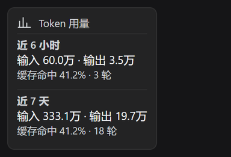
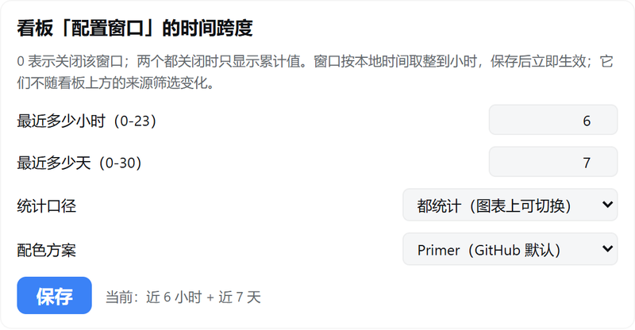

# dsh-desktop-token-usage

[English](https://github.com/jd04063221/dsh-desktop-token-usage/blob/main/README.md) | [中文](https://github.com/jd04063221/dsh-desktop-token-usage/blob/main/translations/README-zh.md) | [繁體中文（臺灣）](https://github.com/jd04063221/dsh-desktop-token-usage/blob/main/translations/README-zh-TW.md) | [繁體中文（香港）](https://github.com/jd04063221/dsh-desktop-token-usage/blob/main/translations/README-zh-HK.md) | [Deutsch](https://github.com/jd04063221/dsh-desktop-token-usage/blob/main/translations/README-de.md) | Français | [Español](https://github.com/jd04063221/dsh-desktop-token-usage/blob/main/translations/README-es.md) | [Italiano](https://github.com/jd04063221/dsh-desktop-token-usage/blob/main/translations/README-it.md) | [日本語](https://github.com/jd04063221/dsh-desktop-token-usage/blob/main/translations/README-ja.md) | [한국어](https://github.com/jd04063221/dsh-desktop-token-usage/blob/main/translations/README-ko.md)

Un plugin de statistiques d'utilisation des tokens **entièrement hors ligne** pour DSH (DeepSeek Harness).

- La **moitié Host** scanne `$DSH_HOME/sessions/**/session.vN.jsonl.zstd` et replie l'usage réel des tokens ;
- La **moitié Client** monte une carte d'usage en pied de la barre latérale gauche ; un clic ouvre un tableau de bord
  dans le panneau central : filtres de plage temporelle et de source, 6 cartes de statistiques, une ligne de fenêtres
  configurées, une carte de chaleur d'activité, une tendance quotidienne des tokens (une courbe de taux de réussite du
  cache superposée aux barres de tokens, de vrais pourcentages étiquetés à droite, son axe Y marge de 10 % au-delà du
  min/max de la période), et un graphique en anneau de l'usage par modèle avec une liste.

Quelles plages temporelles rapportent la carte et la ligne **Fenêtres configurées** du tableau de bord est décidé par la
**configuration du plugin** (les deux fenêtres sont désactivées par défaut) : dans **Paramètres → Plugins → `Token 用量`**
(utilisation des tokens) vous pouvez activer indépendamment une fenêtre « dernières N heures » (0-23) et une fenêtre
« derniers N jours » (1-30) ; désactivez les deux et chaque surface retombe sur un bloc cumulé unique.
Ces fenêtres sont un recul d'horloge et ignorent délibérément le filtre de source du tableau de bord ; elles occupent
donc une ligne à part plutôt que de se mêler aux cartes de statistiques qui suivent le filtre.
La même page de réglages choisit aussi le **regroupement** — par modèle, par fournisseur, ou les deux (avec les deux,
la section de tendance et la section de répartition, `Répartition de l'usage`, reçoivent chacune une pastille
commutable) — et la **palette de couleurs** — Primer, cvd ou Atténuée, chacune avec un jeu clair et un jeu sombre qui
suit le sélecteur clair/sombre de DSH (`body[data-ds-dark-theme]`), si bien que les graphiques ne sont jamais en
désaccord avec la coque.

Le pied de la barre latérale est une seule ligne horizontale partagée avec tous les autres plugins enregistrés là, et
chacun d'eux déclare `width: 100%` — si bien qu'aucun d'eux ne peut la partager. Mesuré en direct, sans rien intervenir
cette carte est comprimée à 105.2px. La carte transforme donc cette ligne en **colonne**
(`[class*="_footerActions"]:has(.dtu-footCard)` — calée sur le suffixe de classe plus `:has()`, donc rien ne dépend des
noms de classe hachés de DSH et aucun ancêtre n'est touché), ce qui donne à chaque plugin dans le siège la ligne pleine
largeur pour laquelle il a été écrit ; cette carte couvre les 256px entiers. C'est `flex-direction` plutôt que
`flex-wrap` parce que la coque enveloppe chaque slot dans un élément `display: contents` — un sélecteur d'enfant
direct ne matche jamais le siège — et parce que sur un siège en colonne `flex-wrap` signifie « commencer une autre
colonne », ce qui pousserait la carte à côté de son voisin. Cela demande `:has()` ; voir le tableau de compatibilité
ci-dessous.

Pas d'accès réseau, pas de télémétrie, pas d'appels API : chaque nombre vient de journaux de sessions déjà présents sur
votre machine.

## Captures d'écran

Rendu à partir des propres composants du plugin avec des **données d'exemple** — les captures sont produites hors ligne par
[`scripts/render-shots.mjs`](../scripts/render-shots.mjs) (le vrai `client.js` et le vrai CSS face à un faux Host) plus
[`scripts/render-shots.py`](../scripts/render-shots.py) (Chrome sans tête), si bien qu'aucun journal de session, chemin ou
détail de compte n'y figure. Thème clair d'abord, thème sombre ensuite. Les captures sont rendues en chinois — le premier
script prend `--locale <id>` pour rendre une autre langue — et les dix variantes linguistiques de ce README partagent le
même jeu.


Six cartes de statistiques, la ligne de fenêtres configurées, la carte de chaleur d'activité, la tendance quotidienne des
tokens avec la courbe de taux de réussite du cache superposée aux barres, et la répartition de l'usage par modèle.


Le même tableau de bord en thème sombre — chaque palette fournit un jeu clair et un jeu sombre.

| Carte de chaleur d'activité | Tendance quotidienne |
|---|---|
|  |  |

| La carte de la barre latérale | Sa page dans le gestionnaire de plugins |
|---|---|
|  |  |

La carte en pied de la barre latérale affiche les deux fenêtres configurées ; un clic dessus ouvre le tableau de bord
ci-dessus. La page du plugin dans le gestionnaire de plugins porte les plages des fenêtres, le regroupement et la palette.

## Compatibilité et environnement testé

**Entièrement vérifié sur DSH Desktop 0.1.7-rc.2 et 0.2.0-rc.2, contrôlé pour compatibilité avec 0.2.0-rc.1.**

| Élément | Environnement testé |
|---|---|
| DSH | Desktop `0.1.7-rc.2` et `0.2.0-rc.2` (vérification complète), `0.2.0-rc.1` (contrôle de compatibilité) |
| Environnement d'exécution embarqué | Electron 44 / Chromium 152 / Node 24.18.1 (transformer le siège en colonne nécessite `:has()`, Chrome 105+ ; le thème des palettes nécessite `light-dark()`, Chrome 123+) |
| Système d'exploitation | Windows 11 Pro, build 26200, AMD64 |
| Node (utilisé pour lancer les tests) | v25.2.1, v26.7.0 |

La vérification est allée bien au-delà de « ça s'installe » : activation du plugin jusqu'à `fiberPhase: active`, rendu de
la carte de la barre latérale et du tableau de bord central, la carte de configuration portée par la page du plugin
lisible et inscriptible, les appels Remote navigateur → Host fonctionnels de bout en bout, et chaque champ correspondant
à la propre cache de projection de DSH lors d'un contrôle croisé.

Pour `0.2.0-rc.1` le contrôle a été structurel plutôt qu'une seconde exécution complète. Chaque paquet publié auquel ce
plugin touche a été comparé à `0.1.7-rc.2` : `dsh-plugin-manager` est identique au caractère près, et dans
`dsh-client-ui-sidebar`, `dsh-client-ui-layout` et `dsh-client-ui-cordis` seuls la chaîne de version, un appel
d'analyse et le CSS de la barre de titre diffèrent. Le contrat de slot `sidebar.footer.action` et ses props propriétaires
`{ wide }` sont inchangés, et les paquets que ce plugin importe (`dsh-api-remotes`, `dsh-client-ui-layout`,
`dsh-client-ui-sidebar`) conservent leurs noms. Un essai manuel sur `0.2.0-rc.1` rend le tableau de bord et les appels
Remote fonctionnels ; `0.2.0-rc.2` a ensuite eu droit à l'exécution complète sur la machine de développement de ce
plugin : activation jusqu'à `fiberPhase: active`, carte et tableau de bord émettant de vrais appels Remote
(`calls.json`), et les fenêtres actives dans `boot.json` conformes au profile.

Ce plugin ne déclare **aucune** peer dependency `@deepseek-ai/dsh*`, et c'est ce que DSH valide réellement — une plage
peer absente n'applique aucune contrainte de version. `engines.dsh` est déclaré comme `^0.1.7-rc.2 || ^0.2.0-rc.1` pour
les humains seulement : la documentation officielle dit clairement que déclarer une plage ne rejette pas les hôtes
incompatibles.

**Les versions autres que celles du tableau ci-dessus ne sont pas testées.** Les builds DSH plus anciens peuvent manquer
le slot `plugins.bundle.config` et le service `configEditor` que ce plugin utilise (sans eux il n'y a pas de carte de
configuration, et la configuration ne peut être modifiée qu'à la main dans le patch du profile) ; les builds plus
récents que `0.2.0-rc.2` n'ont pas encore été vérifiés.

## Ce qu'il écrit sur le disque

Le plugin lit les journaux de sessions et n'écrit que dans un répertoire qui lui est propre :
`$DSH_HOME/cache/dsh-desktop-token-usage/`. Rien n'est écrit à côté d'un journal de session, rien d'autre sous
`$DSH_HOME` n'est créé, modifié ou supprimé, et aucun accès réseau n'est jamais effectué.

| Fichier dans ce répertoire | Écrit par | Utilité | Pour le désactiver |
|---|---|---|---|
| `sessions-index.json` | `lib/session-usage.js` | Cache de pliage par session, pour qu'un appel chaud ne rescanne pas chaque `session.vN.jsonl.zstd` | Supprimez-le ; il est reconstruit au prochain appel |
| `calls.json` | `index.js` | Diagnostics : les 20 derniers appels Remote | `DSH_TOKEN_USAGE_DIAG=0` |
| `boot.json` | `index.js` | Diagnostics : quand le fiber a été appliqué pour la dernière fois | `DSH_TOKEN_USAGE_DIAG=0` |

Les deux écritures sont **atomiques** : elles écrivent un fichier frère `<name>.<pid>.tmp` puis le renomment par-dessus
la cible, si bien qu'un lecteur concurrent ne voit jamais un fichier à moitié écrit et qu'un processus tué ne peut
laisser un fichier tronqué. L'index est plafonné à 800 entrées (les plus anciennes sont abandonnées, rescannées à la
demande), et tout `.tmp` laissé par un crash est balayé à l'écriture suivante.

## Installation

Ce dépôt est un bundle DSH (`package.json` déclare `dsh.bundle.patch` et `dsh.client`). Installez-le par le point
d'entrée officiel ; aucune modification manuelle des fichiers du profile n'est nécessaire. Le paquet est publié sur le registre npm
officiel, le nom du paquet suffit donc — le gestionnaire le résout dans le registre et l'installe dans le profile
courant :

```
plugin_manager  action: install_bundle  target: dsh-desktop-token-usage
```

Pour une installation depuis un répertoire local (par exemple pour exécuter un `main` non publié), indiquez plutôt à
`install_bundle` le chemin absolu de ce répertoire.

```
plugin_manager  action: install_bundle  target: <absolute path to this directory>
```

Parce que ce paquet dépend de `@deepseek-ai/schemastery` (la bibliothèque de schémas dont la carte Config officielle a
besoin), et que `install_bundle` utilise une installation `link:` pour les répertoires locaux et n'installe **pas** les
dépendances des paquets liés, installez une fois dans ce dépôt d'abord :

```
npm install            # installs dev/runtime dependencies only, no network data
```

### Après modification du code : le client se recharge à chaud, le Host exige un redémarrage

| Quelle moitié vous avez modifiée | Comment cela prend effet |
|---|---|
| `client.js` (interface) | L'instantané de module côté navigateur est poussé à la page par HMR dès que sa mtime/size change ; si cela ne prend pas effet, rafraîchissez fortement la page une fois (Ctrl/Cmd+Shift+R) |
| `index.js` / `lib/*` (Host) | **DSH doit être redémarré** : réactiver l'entrée ne fait que remonter le fiber, il ne réimporte pas la génération de module JS mise en cache. De même, ajouter ou modifier des champs `Config` exige aussi un redémarrage avant qu'ils n'apparaissent dans les Paramètres |

Pour savoir quelle version tourne actuellement : vérifiez si `$DSH_HOME/cache/dsh-desktop-token-usage/boot.json` existe
et si `windows` correspond aux attentes.

Désinstallation : `plugin_manager action: remove_bundle target: dsh-desktop-token-usage`.

> Le nom du paquet et la **row id** du plugin sont deux choses différentes : la row id est `dsh-desktop-token-usage` (l'ancre des
> surcharges de configuration dans le profile), et le nom du paquet est `dsh-desktop-token-usage`. Utilisez le nom du
> paquet pour désinstaller/installer, et la row id pour changer la configuration.

## Utilisation

1. Regardez la carte en **bas de la barre latérale gauche**, au-dessus de Paramètres : elle affiche le volume
   entrée/sortie de chaque fenêtre et le taux de réussite du cache selon votre configuration ;
2. Cliquez dessus → le tableau de bord s'ouvre dans le panneau central ;
3. En haut du tableau de bord vous pouvez filtrer par **plage temporelle** (7/14/30/90 derniers jours, tout,
   personnalisé) et par **source** ; un bouton d'actualisation se trouve en bas à droite.

Le filtrage comme l'agrégation ont lieu dans le Host : chaque changement émet une nouvelle requête d'agrégation au Host
(le Host tient un cache d'index indexé par mtime+size de fichier, si bien que les appels chauds se comptent en centaines
de millisecondes). La carte se rafraîchit discrètement une fois toutes les 5 minutes — la fenêtre horaire glisse de toute
façon avec l'horloge, donc elle devrait se mettre à jour même sans nouvel usage.

### Comment lire la carte de chaleur d'activité

- C'est un **calendrier** (aligné sur lundi, les 53 dernières semaines) avec des axes **mois** et **jour de la semaine** ;
  les cellules se partagent la largeur de la carte, si bien qu'elles s'étirent avec elle et restent carrées (11px est la
  taille de référence) ;
- L'échelle de couleurs utilise des **quartiles sur les jours non nuls**, et non « jour ÷ maximum » — avec la seconde,
  un seul jour exceptionnellement grand presse tout le reste dans la même nuance de gris ;
- L'en-tête bascule entre **Tokens / tours** ; par défaut c'est la dimension qui a **plus de jours de données** (sur une
  machine avec beaucoup d'historique importé les tokens sont clairsemés, donc dessiner les tokens par défaut donnerait
  une grille presque vide) ;
- Elle **suit le filtre de source mais n'est pas affectée par la plage temporelle** : un calendrier filtré à 7 jours
  signifierait « 7 cellules allumées dans une grille d'un an », ce qui est exactement ce qu'une carte de chaleur ne
  devrait pas ressembler.

## Localisation

Le tableau de bord suit **le propre réglage de langue de DSH**. Il n'a pas de sélecteur de langue à lui : changez la
langue dans DSH et le tableau de bord bascule avec, immédiatement et sans rechargement.

- `en` et `zh` sont les locales intégrées de DSH, et ce plugin fournit un dictionnaire pour les deux ;
- Les paquets de langue suivants sont enregistrés dans le catalogue de DSH, si bien qu'ils apparaissent dans son propre
  sélecteur : `zh-TW` (臺灣正體), `zh-HK` (香港繁體), `de`, `fr`, `es`, `it`, `ja` et `ko`. Les six codes restants — `pt-BR`, `ru`,
  `vi`, `th`, `id` et `ar` (de droite à gauche) — sont conçus mais pas encore implémentés ; voir
  [la conception](../docs/superpowers/specs/2026-10-01-i18n-design.md) ;
- Les textes vivent dans `locales/<id>.json`, un fichier plat par langue, et sont générés dans `client.js` par
  `node scripts/build-dicts.mjs`. Ne modifiez jamais le bloc généré à la main — `npm test` échoue lorsqu'il est périmé ;
- Les nombres, pourcentages, dates, noms de jours et de mois et les formes de pluriel viennent tous de `Intl`, si bien
  qu'une langue qui groupe les milliers autrement, écrit `萬`/`億` là où l'anglais écrit `K`/`M`/`B`, ou module ses
  pluriels s'affiche correctement ;
- `translations/README-<id>.md` et `translations/CHANGELOG-<id>.md` portent les deux documents dans chacune des dix langues. Ils restent dans le
  dépôt pour GitHub ; npm n'affiche que `README.md`.

## Configuration

Modifiez-les dans la page **Plugins → `Token 用量`** (utilisation des tokens) — l'entrée `Plugins` de la barre latérale
→ `Token 用量` : au milieu de la page vous obtenez deux champs étiquetés
`Plage temporelle des fenêtres configurées du tableau de bord` (la plage temporelle affichée sur la carte de la barre
latérale) et un bouton d'enregistrement.

DSH **ne génère pas** d'éditeur automatiquement à partir du schéma `Config` — un plugin qui apporte sa propre
configuration doit rendre le formulaire dans le slot `plugins.bundle.config` (adressé par nom de paquet). C'est ce que
fait ce plugin : à l'enregistrement il appelle le `configEditor` officiel, et les valeurs atterrissent dans le
`cordis.patch.yml` du profile, si bien que vous pouvez aussi les écrire directement là :

```yaml
- id: dsh-desktop-token-usage
  disabled: false
  config:
    hours: 6
    days: 7
```

| Clé | Par défaut | Description |
|---|---|---|
| `hours` | `0` | Combien de heures la section Fenêtres configurées rapporte (0-23). `0` = désactive cette fenêtre |
| `days` | `0` | Combien de jours la section Fenêtres configurées rapporte (1-30). `0` = désactive cette fenêtre |

Avec les deux fenêtres désactivées (la valeur par défaut) la carte affiche les valeurs cumulées, comme avant l'existence
de ces deux paramètres. Les fenêtres s'arrondissent à l'heure en **heure locale** : « dernières 6 heures » signifie à
partir du début de l'heure d'il y a 6 heures.

Les changements prennent effet **immédiatement** après l'enregistrement : le `fiber.update()` de Cordis redémarre le
fiber de ce plugin et `apply` tourne à nouveau avec la nouvelle configuration (vous n'avez donc jamais besoin de
redémarrer DSH pour changer une valeur) ; après l'enregistrement, le formulaire relit la configuration et rafraîchit la
carte automatiquement.


## Sémantique des données

Cette section est importante — la signification des nombres est entièrement déterminée par la sémantique des journaux
de DSH.

| Mesure | Définition |
|---|---|
| Usage Tokens | `uncached input + output + cache read + cache write` |
| **Volume d'entrée** (carte) | `uncached input + cache read` — c'est-à-dire chaque token de prompt que le fournisseur a réellement reçu |
| **Volume de sortie** (carte) | `usage.outputTokens` (`reasoningTokens` en est un **sous-ensemble** et n'est jamais compté deux fois) |
| Entrée non mise en cache | `usage.inputTokens` — **dans les champs natifs du fournisseur c'est déjà la partie qui a manqué le cache** ; la propre projection de DSH le renomme en `uncachedInputTokens` |
| Lecture / écriture de cache | `usage.cacheReadTokens` / `usage.cacheWriteTokens` |
| Taux de réussite du cache moyen | `cache read ÷ (cache read + uncached input + cache write)` — le côté échec inclut les écritures de cache |
| Nombre de requêtes | Nombre d'appels de modèle après règlement (voir « pliage » ci-dessous) |
| Tours terminés | Nombre d'événements `turn/end` |
| Jours d'activité | Nombre de jours locaux avec des token ou des tours (selon le **fuseau horaire local**, pas UTC) |
| Regroupement par modèle | Le **dernier segment** de l'id de modèle : un modèle arrive comme `deepseek/deepseek-v4.1-flash` depuis `commandcode` et comme `deepseek-v4.1-flash` depuis `opencode-go`, et les deux se replient en une ligne ; le regroupement par fournisseur les garde toujours séparés |

**Sémantique de pliage (un endroit facile pour se tromper dans le calcul)** : dans le même `(turn, step)`, une entrée
d'usage ultérieure **remplace** la précédente — les chiffres de streaming sont écrasés par le règlement final ; seulement
après que `llm/retry-started` ferme le slot, un autre appel de retry **s'accumule**. Donc « total = somme de tout
l'usage » est faux ; il faut plier. La logique de pliage de ce plugin correspond ligne pour ligne à la projection
`tokenUsage` de `dsh-token-meter`, et est couverte par des tests de recoupement.

### Pourquoi le filtre de source n'a que trois options

Les journaux de sessions de DSH 0.1.7-rc.2 n'ont **aucun** champ « source du client » : `SessionHeader` ne porte que
`version/id/createdAt/cwd/parentSession/isSeeded/origin/delegationDepth/agentPreset`, et la seule valeur que `origin`
ait jamais prise est `'subagent'`. Le desktop et le web ne peuvent pas être distingués à partir des données locales. Le
tableau de bord n'offre donc que les trois options **déductibles de signaux locaux** :

| Libellé | Comment il est déterminé |
|---|---|
| Desktop · Web | Il existe un tour utilisateur réel (`user/message` avec `source.kind ∈ {user, user-approval}`) et il porte `source.rpcId` |
| CLI · Bots | Il y a un tour utilisateur réel mais **pas** de `rpcId` (headless / SDK / ACP / bots et autres, sans client pour piloter) |
| Sous-agents | `header.origin === 'subagent'` ou `delegationDepth > 0` |

Les sessions sans aucun tour utilisateur (par exemple celles qui n'ont exécuté que des commandes en slash) comptent pour
`Toutes` (toutes) et ne sont pas listées séparément.

## Limitations connues

- **La première agrégation est lente** : avec environ 150 fichiers de sessions et plus de 90 000 enregistrements, un
  démarrage à froid prend environ 3–4 secondes ; ensuite tout devient incrémental par empreinte de fichier, les appels
  chauds se comptant en centaines de millisecondes. Le cache est écrit dans
  `$DSH_HOME/cache/dsh-desktop-token-usage/sessions-index.json` ; le supprimer ne fait que ralentir le prochain lancement.
- **Les sessions historiques importées peuvent signaler un usage de zéro** : si une session historique a été importée
  (une migration reasonix, par exemple), ses champs d'usage sont réellement tous à 0. Ce sont des données valides, pas
  des données manquantes, et ce plugin ne se rabat pas sur une estimation.
- **Dix langues seulement sont traduites** : le tableau de bord suit le réglage de langue de DSH, mais ses textes ne couvrent
  pas encore toutes les langues vers lesquelles DSH peut être réglé ; la section Localisation ci-dessus liste les six qui manquent.
- **Les fenêtres s'arrondissent à l'heure** : les journaux n'ont pas de compartiments au niveau de la minute, donc
  « dernière 1 heure » s'aligne sur le début de l'heure.
- **La carte se rafraîchit avec un délai** : il n'y a pas de canal de poussée Host→Client, la carte repose donc sur un
  minuteur de rafraîchissement silencieux de 5 minutes ; si vous venez de changer la configuration ou voulez une mise à
  jour tout de suite, cliquez sur la carte pour ouvrir le tableau de bord puis cliquez sur `Actualiser`.

## État de vérification

Vérifications effectuées à ce jour (voir la section « preuves de vérification » de `docs/DESIGN.md`) :

- Le résultat plié correspond à la **propre cache de projection de DSH** champ par champ (`session-5964a5d3-*` : `286650 / 182633 / 43826560 / 0`) ;
- Les résumés par jour et par modèle se recréent à partir du total, et les plages de millisecondes par jour/par heure partitionnent exactement le total ;
- Résumés de fenêtres de la carte : chaque fenêtre ne peut être que inférieure ou égale à la valeur cumulée, l'identité de
  la répartition entrée/sortie tient, et les paramètres hors plage (`hours=99`/`days=-3`) sont bornés ;
- Le schéma `Config` se valide via l'interface Standard Schema : 0/0 par défaut, tandis que `hours=24` et `days=31` sont rejetés ;
- Le descripteur du Host et la contribution du Client sont **recoupés champ par champ** dans les tests, et le codec de
  paramètres accepte les valeurs que le navigateur envoie réellement ;
- Les deux moitiés client se rendent dans un environnement sans navigateur avec un React/DOM simulé (couvrant la ligne de
  fenêtres de la carte et le repli cumulé), avec des assertions sur l'injection de styles et le démontage ;
- Après installation, `include:dsh-desktop-token-usage` a un `fiberPhase` = `active`, et `dsh-desktop-token-usage` apparaît dans
  `sidebar.footer.action` et `main` (`active: true`) ;
- Le chemin RPC navigateur → Host est prouvé fonctionnel (l'index côté Host est réécrit après que la page l'appelle).

**Confirmé / demande encore votre confirmation** :

1. **Le chemin de configuration côté Host a été vérifié de bout en bout** : `Config.listConfigs` rapporte `status: schema`
   pour ce plugin (`id: include:dsh-desktop-token-usage`, `name` est le nom du paquet) ; après redémarrage du fiber, les
   `windows` de `boot.json` valent le `{hours:5, days:1}` configuré dans le profile — aussi bien la lecture de la
   configuration que son écriture via `configEditor` fonctionnent correctement sous le nom de paquet avec scope.
2. **Le client exige encore un rafraîchissement forcé de la page** (Ctrl/Cmd+Shift+R) : la carte de configuration au milieu
   de la page du plugin est enregistrée par le client (`plugins.bundle.config` est indexé par **nom du paquet**), et un
   nouveau module client doit être chargé avant qu'elle n'apparaisse.
3. **La génération de modules du Host exige encore un redémarrage** : Node met en cache les ESM par realpath résolu, si
   bien que modifier des fichiers — ou même renommer le paquet — ne les réimporte pas ; en pratique
   `import('dsh-desktop-token-usage') === import('dsh-desktop-token-usage')` désigne la même instance de module. Le nouveau
   code Host tel que le `payload.heatmap` dont dépend la carte de chaleur ne peut donc être chargé qu'en redémarrant ;
   d'ici là le client prend le repli « `heatmap` manquant ».
4. Le visuel du tableau de bord (y compris la carte de chaleur refaite) demande vos propres yeux — cet environnement ne
   contrôle pas de navigateur.

### Où regarder quand quelque chose casse

Deux fichiers d'auto-diagnostic vivent sous `$DSH_HOME/cache/dsh-desktop-token-usage/` :

- `boot.json` : la chaîne d'activation du Host (`appliedAt`/`injectedAt`/`providedAt`/`registeredAt`) et les `windows`
  actives ; s'il y a une `error`, elle indique à quelle étape cela a bloqué. Chaque `apply` le réécrit, donc `appliedAt`
  est l'heure du dernier remontage du fiber ; mais **il ne peut pas prouver que vous exécutez le code le plus récent** —
  modifier des fichiers ne réimporte pas les modules, seul un redémarrage le fait.
- `calls.json` : les 20 dernières requêtes du tableau de bord (filtres, fenêtre, nombre de sessions, total de tokens,
  temps écoulé). **Une entrée prouve que la voie navigateur → Host fonctionne ; l'absence d'entrées ne prouve pas à elle
  seule que la voie est cassée** (le fichier a pu être supprimé), lisez-le donc avec `boot.json` ; s'il n'y a vraiment
  jamais eu d'entrée, le module client n'a très probablement jamais été chargé — **rafraîchissez fortement la page**
  (Ctrl/Cmd+Shift+R).

Aussi, le `status` de `Config.listConfigs` vous dit directement si le module du fiber actuel exporte `Config` :
`absent` = une ancienne génération de module (il n'y aura pas de carte de configuration sur la page du plugin) ;
`schema` = un schéma schemastery a été reconnu (ce qui est le cas de ce plugin). Notez que `schema` signifie seulement
qu'il **peut être validé** ; l'interface de configuration est toujours rendue par le plugin lui-même dans la page du
plugin (voir « Configuration » plus haut), et DSH ne générera pas de formulaire à partir du schéma.
Un client plus ancien que le Host pose aussi des problèmes — c'est pourquoi le client **revient aux valeurs cumulées**
quand il n'obtient pas le champ `card`, au lieu de rester sur « chargement ».

## Développement

```
npm install     # installs @deepseek-ai/schemastery (a link install does not install dependencies for linked packages)
npm test        # node --test: aggregation golden cross-check + window summaries + browserless client smoke tests
```

Les tests lancent aussi `apply` ; quand ils écrivent des fichiers de diagnostic, ils les dirigent vers un répertoire
temporaire (`DSH_TOKEN_USAGE_DIAG_DIR`) et ne remplaceront pas les deux fichiers que vous voulez inspecter sous
`$DSH_HOME/cache/dsh-desktop-token-usage/`.

Structure :

```
index.js                     Host half: Config (schemastery) + registration of the usage Remote service
client.js                    Client half: window __ModuleLoader__ factory + dashboard and sidebar entry
lib/session-usage.js         Pure Node aggregation: multi-frame zstd reading, folding, hourly bucketing, window summaries, index cache
test/session-usage.test.mjs  Aggregation, millisecond ranges, card windows, calendar, Config schema, Remote service
test/client-smoke.test.mjs   Client factory / slot registration / two-half wire-contract cross-check / rendering
docs/DESIGN.md               Design, data contracts, pitfalls hit, and verification evidence
docs/research/               Earlier research notes and reusable session-log probe scripts
CHANGELOG.md                 Version history (with a commit index)
translations/                 Les README et CHANGELOG des neuf autres langues
```

Les documents existent en dix langues : l'anglais est la valeur par défaut (`README.md` / `CHANGELOG.md`), et chaque autre
langue a son propre `translations/README-<id>.md` / `translations/CHANGELOG-<id>.md`. Les dix sont reliées entre elles par le sélecteur à la ligne 3 de chaque fichier.

## Licence

MIT
